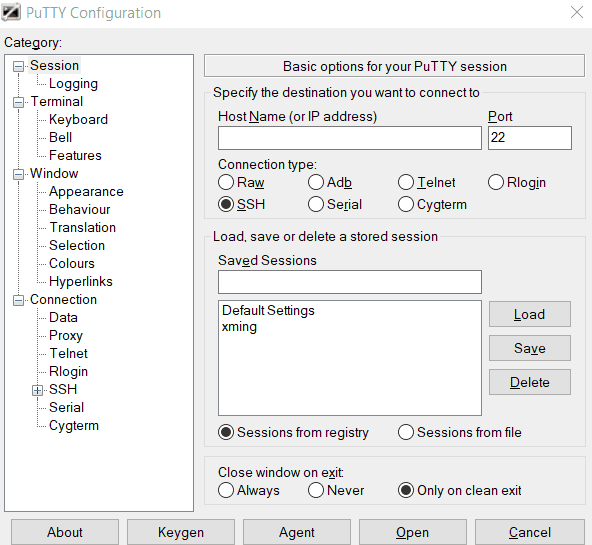
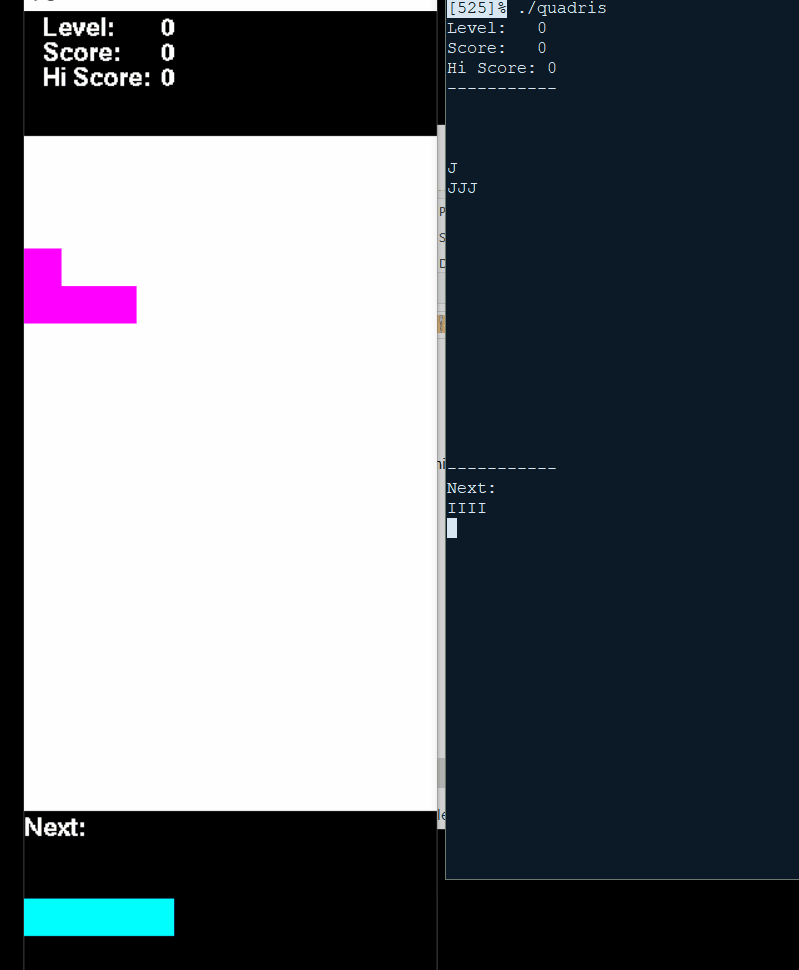

# Quadris

Quadris is a Tetris-like game that myself and 2 other students worked on for our final project. 

## Installation
Requires Xming for GUI : http://www.geo.mtu.edu/geoschem/docs/putty_install.html


```bash
git clone https://github.com/akassab/QuadrisProject.git
cd QuadrisProjectProject/quadris
make
./quadris
```
## Usage
Input(command line only): 
"right", "left", "down", "clockwise", "counterclockwise", 
"5right, "5left", "5down", "5clockwise, "5counterclockwise"

Must end with "drop" 



Perfect example script:
```Shell
drop
5right drop
3right drop
clockwise drop
4right clockwise drop
clockwise 2right drop
6right drop
6right 3clockwise drop
clockwise 10right drop
5right drop
right drop
3right clockwise drop
4right drop
7right 3clockwise drop
clockwise drop
clockwise 9right drop


```

